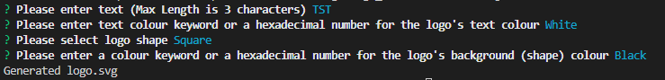

# SVG Logo Maker

## Description

The following challenge involved creating a Node.js application that generates SVG Logos. The application prompts the user for text, font color, shape, and background color. The logo itself will be 300x200 ‘logo.svg’ file.
-	The text entered cannot be longer than 3 characters
-	The color must be a color keyword (OR a hexadecimal number)
-	The user will be prompted to select a shape
During this challenge, TDD testing was performed.

Link to Video of Application: https://www.loom.com/share/d8b8e3a981b44a0699434ed8b6dd94e6

## Installation

Please install libraries and run on a console. The application will be invoked by using the following command:

node index.js

## License

none

